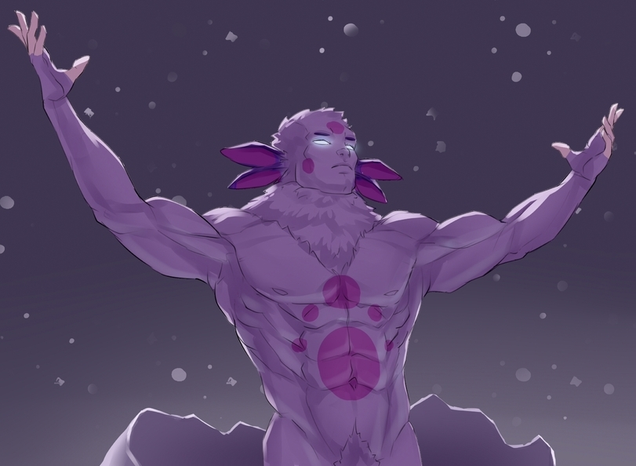

# Singular Value Decomposition implementation

### Three methods must have been implemented

- Primitive implementation
- Using Python standart methods
- Method with an optimization

---

> Two pictures were used in the experiments (Comression factor `N = 2`):

| luntik    | highres   |
| --------- | --------- |
|  |  |

---

## Primitive implementation

| luntik    | highres   |
| --------- | --------- |
|  |  |

### Results

| luntik | highres |
| --- | --- |
| 594 $\times$ 811 | 5304 $\times$ 7952 |
| Initial size: `1.4 MB` | Initial size: `121 MB` |
| After compression: `663 KB` | After compression: `67.4 MB` |
| Execution time: `2.7 s` | Execution time: `3560 s` |

---

## Standard implementation

| luntik    | highres   |
| --------- | --------- |
|  |  |

### Results

| luntik | highres |
| --- | --- |
| 594 $\times$ 811 | 5304 $\times$ 7952 |
| Initial size: `1.4 MB` | Initial size: `121 MB` |
| After compression: `702 KB` | After compression: `65 MB` |
| Execution time: `0.425 s` | Execution time: `380 s` |

---

## Random SVD (method with optimization)

| luntik    | highres   |
| --------- | --------- |
|  |  |

### Results

| luntik | highres |
| --- | --- |
| 594 $\times$ 811 | 5304 $\times$ 7952 |
| Initial size: `1.4 MB` | Initial size: `121 MB` |
| After compression: `494 KB` | After compression: `65 MB` |
| Execution time: `0.118 s` | Execution time: `9.2 s` |

---

### Saving middle representation

- Image data is saved in `.lol` files
- Each pictures's data file stores information about:
  - metadata about picture's width, height, N (compression factor)
  - U, S, V matrices of each color chanel of the picture
